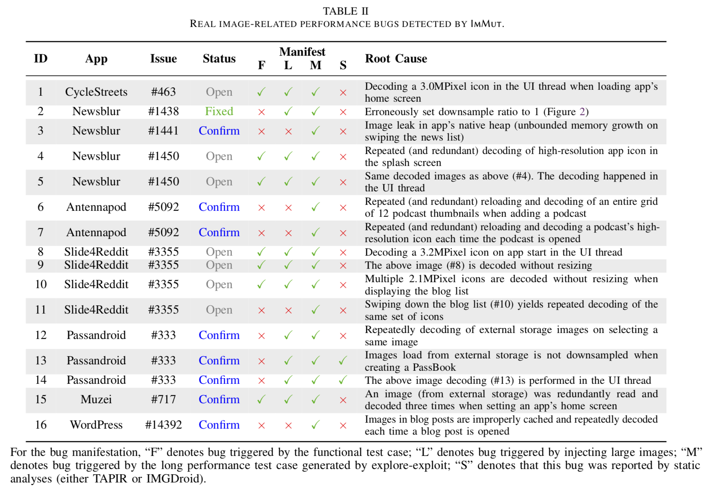
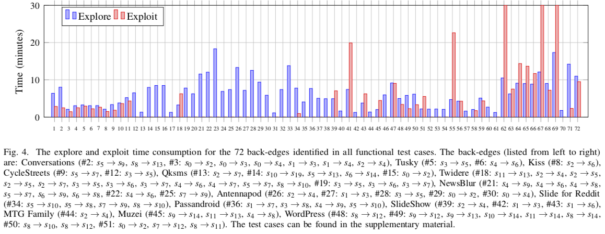

## Introduction
Image displaying in Android apps is resource-intensive. Improperly displayed images result in performance degradation or even more severe consequences like app crashes. Existing static performance anti-pattern checkers are conservative and limited to a small set of bugs. This paper presents ImMut, the first test augmentation approach to performance testing for image displaying in Android apps to complement these static checkers. Given a functional test case, ImMut mutates it towards a performance test case by either (1) injecting external-source images with large ones or (2) copy-pasting a repeatable fragment and slightly mutating the copies to display many (potentially distinct) images. Evaluation on our prototype implementation showed promising results that ImMut revealed 16 previously unknown performance bugs that are beyond the capability of state-of-the-art static checkers.

## ImMut Framework
ImMut performs the following two operations to efficiently mutate a functional test case towards displaying large/many images (and thus IID (Inefficient Image Displaying) issue exposure)
- **(1) Injecting large images.** ImMut hooks image decoding APIs and considers any byte[], InputStream, FileDescriptor, or an external String URL/filename as external-source. Any sufficiently large external-source image is considered to be potentially arbitrarily large (and thus external-source static images like icons are filtered out). These images are replaced with our prepared large images.

- **(2) Explore-exploit to display many images.**
ImMut tries to “copy-paste” an event fragment (a fragment of consecutive events) in the functional test case to display many images. ImMut first explores a given functional test case’s mutants by changing an event’s receiver to its sibling widget or injecting a swipe to a container widget.
Then, ImMut exploits these mutated and injected events by copy-pasting a repeatable fragment in the test case (an event fragment that starts from and ends with an identical GUI state) for as many times, and replace the pasted fragments with explored event mutants. For each repeatable fragment, ImMut generates a single long performance test case, which is run and checked against our IID test oracle.

## Evaluation
#### Experimental Setup
- **Android app subjects.**
[16 actively maintained apps](https://github.com/anonymouswhom/ImMut/tree/main/Android-app-subjects) being well-verified by an existing static IID issue detector are selected as our evaluation subjects. 

- **Injected image resource.**
[Four images](https://github.com/anonymouswhom/ImMut/tree/main/Inject-image-resources) are prepared and will be injected to validate proper downsampling:
960×800 (0.76MPixels)/1920×1600 (3.1MPixels)/2835×2120 (6.0MPixels/4032×3016 (12.2MPixels).

- **Functional test cases.**
[51 functional test cases](https://github.com/anonymouswhom/ImMut/tree/main/Functional-test-cases) provided by a recruited post-graduate student that can cover major functionalities of the Android app subjects.

#### Evaluation Results

- **The IID issues detected by ImMut.**
ImMut reported 16 unique IID issues as listed in Table II. We manually confirmed all these reported IID issues as true positives and enclosed these IID issues into 10 bug reports submitted to the corresponding app’s Github issue tracking system. Developers responded to 9/16 IID issues (other issues are still open) by the time this paper was written, and all of them were confirmed as real performance threats. One was already fixed by the developers.

- **The IID issues detected by static analyzers.**
We also applied static analyzers [TAPIR](https://ieeexplore.ieee.org/abstract/document/8668030) and [IMGDroid](https://o2lab.github.io/p/imgdroid.pdf) to our experimental subjects. They reported considerably more IID issue warnings compared with ImMut. However, nearly all ImMut’s reported bugs (14/16, 88%) are not found by static analyses.
The evaluation results are presented [here](https://github.com/anonymouswhom/ImMut/blob/main/Excels/detection%20results.xlsx), where contains three sheets,including  the IID issues detected by ImMut, TAPIR, and IMGDroid.

- **Time Consumption.**
The time consumption study of ImMut is shown in the figure below and the more detail information can be seem [here](https://github.com/anonymouswhom/ImMut/blob/main/Excels/explore-exploit.xlsx). The test cases can be seem [here](https://github.com/anonymouswhom/ImMut/tree/main/Generated-performance-test-cases)

## Conclusion
This paper presents the first dynamic approach to performance testing for image displaying in Android apps. With test augmentation and a pixel-flow based performance test oracle, ImMut can reveal subtle performance bugs beyond the capability of static anti-pattern checkers, demonstrating that testing can be an effective complement for static analysis in detecting image-displaying related performance bugs.

