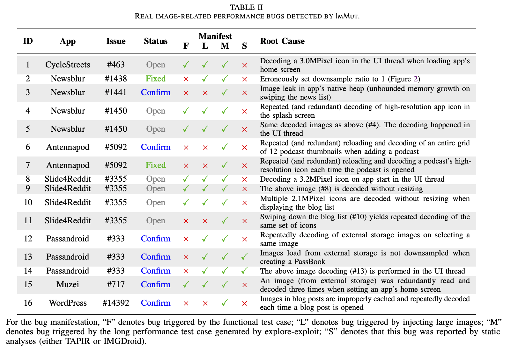
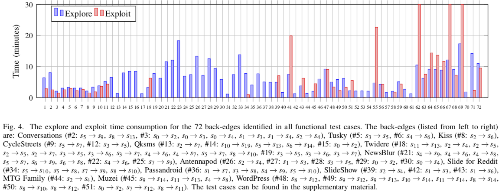

- **The IID issues detected by ImMut.**
ImMut reported 16 unique IID issues as listed in Table II. We manually confirmed all these reported IID issues as true positives and enclosed these IID issues into 10 bug reports submitted to the corresponding app’s Github issue tracking system. Developers responded to 9/16 IID issues (other issues are still open) by the time this paper was written, and all of them were confirmed as real performance threats. One was already fixed by the developers.

- **The IID issues detected by static analyzers.**
We also applied static analyzers [TAPIR](https://ieeexplore.ieee.org/abstract/document/8668030) and [IMGDroid](https://o2lab.github.io/p/imgdroid.pdf) to our experimental subjects. They reported considerably more IID issue warnings compared with ImMut. However, nearly all ImMut’s reported bugs (14/16, 88%) are not found by static analyses.
The evaluation results are presented [here](https://github.com/anonymouswhom/ImMut/blob/main/Excels/detection%20results.xlsx), where contains three sheets,including  the IID issues detected by ImMut, TAPIR, and IMGDroid.

- **Time Consumption.**
The time consumption study of ImMut is shown in the figure below and the more detail information can be seem [here](https://github.com/anonymouswhom/ImMut/blob/main/Excels/explore-exploit.xlsx). The test cases can be seem [here](https://github.com/anonymouswhom/ImMut/tree/main/Generated-performance-test-cases)
